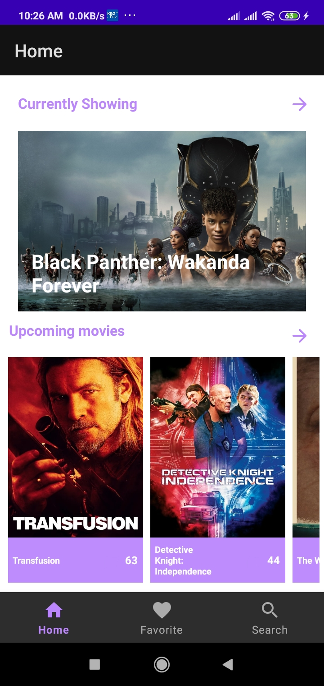
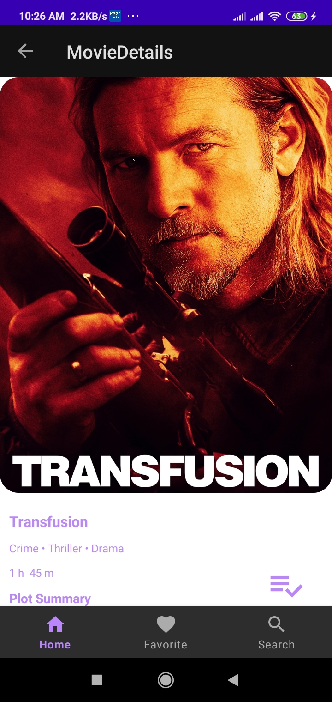
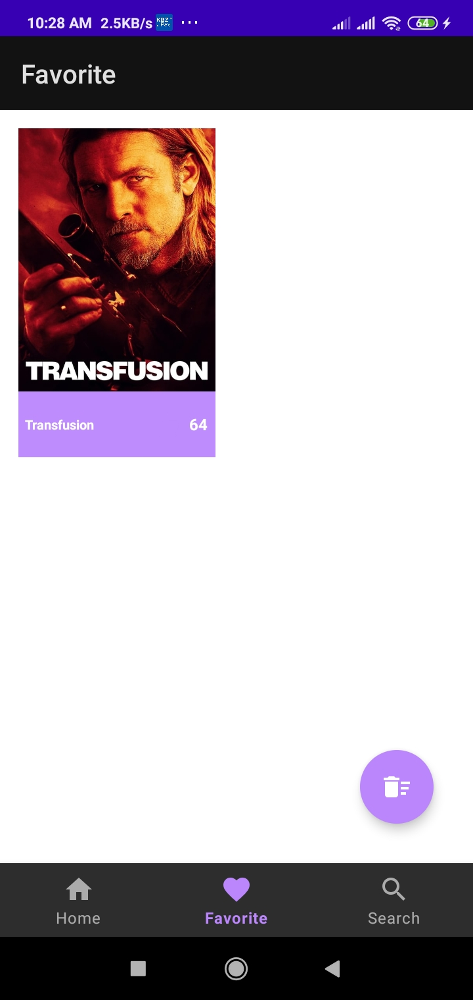
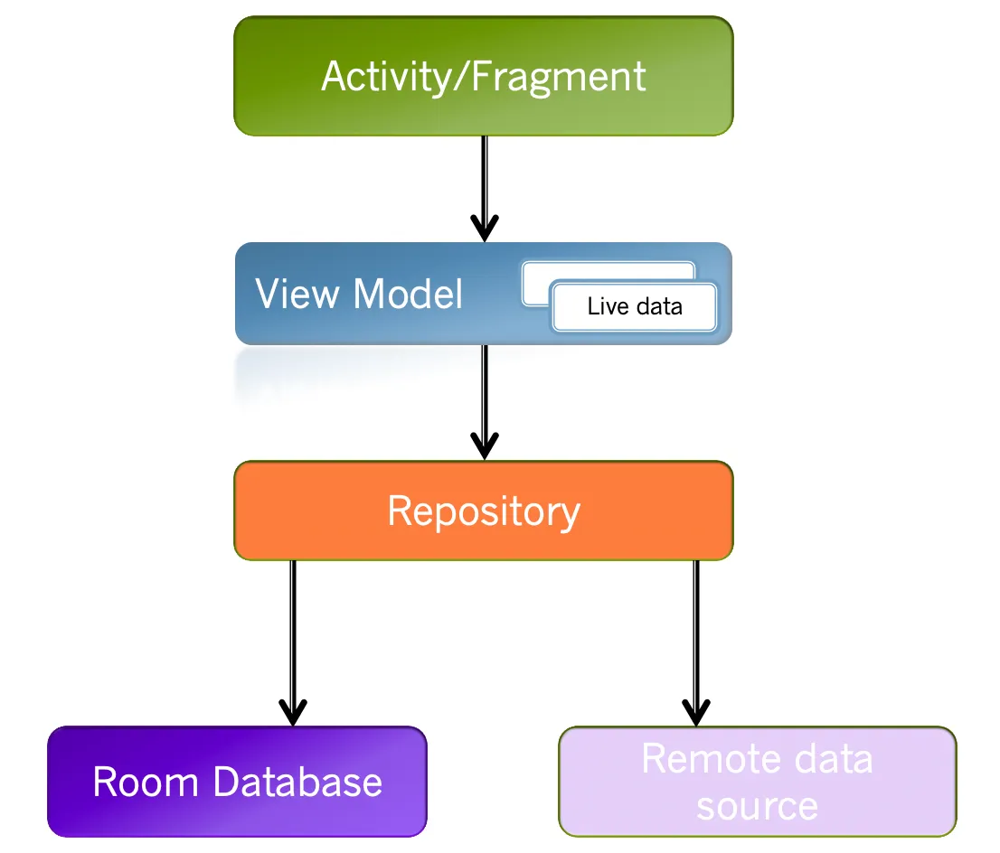

# A simple movie app that connect Movie Api.
### Info 
A sample Movie app using MVVM with android livedata, Retrofit, Rxjava, Dagger, Room and data binding with fragments and activities. The repo contain Master branch for Java and kotlin branch for Kotlin source.
#### Key Features
****
The app cover the following screens:
* currently showing movie collection list
* upcoming movie collection list
* most popular collection list
* top rated movies
* movie detail
* user favorite movies
* search feature


## Screenshot
home|detail|favourite
:--:|:--:|:--:
||

## Architecture


## Repository
```java
public class Repository {
  public static final String TAG = "Repository";

  MovieApiService movieApiService;
  FavoriteDao favoriteDao;

  @Inject
  public Repository(MovieApiService movieApiService, FavoriteDao favoriteDao) {
    this.movieApiService = movieApiService;
    this.favoriteDao = favoriteDao;
  }


  public Observable<MovieResponse> getCurrentlyShowing(HashMap<String, String> map){
    return movieApiService.getCurrentlyShowing(map);
  }

  public Observable<MovieResponse>  getPopular(HashMap<String, String> map){
    return movieApiService.getPopular(map);
  }

  public Observable<MovieResponse>  getTopRated(HashMap<String, String> map){
    return movieApiService.getTopRated(map);
  }

  public Observable<MovieResponse>  getUpcoming(HashMap<String, String> map){
    return movieApiService.getUpcoming(map);
  }

  public Observable<Movie>  getMovieDetails(int movieId, HashMap<String, String> map){
    return movieApiService.getMovieDetails(movieId, map);
  }

  public Observable<JsonObject>  getCast(int movieId, HashMap<String, String> map){
    return movieApiService.getCast(movieId,map);
  }

  public Observable<Actor>  getActorDetails(int personId, HashMap<String,String> map){
    return movieApiService.getActorDetails(personId,map);
  }

  public Observable<JsonObject> getMoviesBySearch( HashMap<String, String> map){
    return movieApiService.getMoviesBySearch(map);

  }

  public void insertMovie(FavoriteMovie favoriteMovie){
    Log.e(TAG, "insertMovie: " );
    favoriteDao.insert(favoriteMovie);
  }

  public void deleteMovie(int movieId){
    favoriteDao.delete(movieId);
  }

  public void clearFavoriteList(){
    favoriteDao.clearFavoriteList();
  }

  public LiveData<List<FavoriteMovie>> getFavoriteList(){
    return  favoriteDao.getFavoriteList();
  }

  public FavoriteMovie getFavoriteListMovie(int movieId){
    return favoriteDao.getFavoriteListMovie(movieId);
  }


}
```
## ViewModel
```java
@HiltViewModel
public class HomeViewModel extends ViewModel {

  public void getPopularMovies(HashMap<String, String> map){
    disposable.add(repository.getPopular(map)
            .subscribeOn(Schedulers.io())
            .observeOn(AndroidSchedulers.mainThread())
            .subscribe(result->popularMoviesList.setValue(result.getResults()),
                    error-> Log.e(TAG, "getPopularMovies: " + error.getMessage() ))
    );
  }

  public void getTopRatedMovies(HashMap<String, String> map) {
    disposable.add(repository.getTopRated(map)
            .subscribeOn(Schedulers.io())
            .observeOn(AndroidSchedulers.mainThread())
            .subscribe(result -> topRatedMoviesList.setValue(result.getResults()),
                    error -> Log.e(TAG, "getTopRated: " + error.getMessage()))
    );
  }

  public void getUpcomingMovies(HashMap<String, String> map) {
    disposable.add(repository.getUpcoming(map)
            .subscribeOn(Schedulers.io())
            .observeOn(AndroidSchedulers.mainThread())
            .subscribe(result -> upcomingMoviesList.setValue(result.getResults()),
                    error -> Log.e(TAG, "getUpcoming: " + error.getMessage()))
    );
  }


  public MutableLiveData<ArrayList<Movie>> getCurrentlyShowingList(){
    return currentMoviesList;
  }

  public MutableLiveData<ArrayList<Movie>> getTopRatedMoviesList(){
    return topRatedMoviesList;
  }

  public MutableLiveData<ArrayList<Movie>> getUpcomingMoviesList(){
    return upcomingMoviesList;
  }

  public MutableLiveData<Movie> getMovie() {
    return movieDetails;
  }

  public void getCurrentlyShowingMovies(HashMap<String, String> map){
    disposable.add(repository.getCurrentlyShowing(map)
            .subscribeOn(Schedulers.io())
            .map(new Function<MovieResponse, ArrayList<Movie>>() {
              @Override
              public ArrayList<Movie> apply(MovieResponse movieResponse) throws Throwable {
                return movieResponse.getResults();
              }
            })
            .observeOn(AndroidSchedulers.mainThread())
            .subscribeWith(new DisposableObserver<ArrayList<Movie>>() {
              @Override
              public void onNext(@io.reactivex.rxjava3.annotations.NonNull ArrayList<Movie> movies) {
                currentMoviesList.setValue(movies);
              }

              @Override
              public void onError(@io.reactivex.rxjava3.annotations.NonNull Throwable e) {

              }

              @Override
              public void onComplete() {

              }
            })
    );
  }

  public MutableLiveData<ArrayList<Movie>> getPopularMoviesList(){
    return popularMoviesList;
  }
  private static final String TAG = "HomeViewModel";
  private Repository repository;
  private MutableLiveData<ArrayList<Movie>> currentMoviesList = new MutableLiveData<>();
  private final CompositeDisposable disposable = new CompositeDisposable();
  private MutableLiveData<Movie> movieDetails = new MutableLiveData<>();
  private MutableLiveData<ArrayList<Movie>> popularMoviesList = new MutableLiveData<>();
  private MutableLiveData<ArrayList<Movie>> topRatedMoviesList = new MutableLiveData<>();
  private MutableLiveData<ArrayList<Movie>> upcomingMoviesList = new MutableLiveData<>();

  @Inject
  public HomeViewModel(Repository repository) {
    this.repository = repository;
  }

}
```
## HomeFragment
```java
@AndroidEntryPoint
public class HomeFragment extends Fragment {

  private HomeViewModel homeViewModel;
  private FragmentHomeBinding binding;
  private ViewPagerAdapter currentMoviesAdapter;
  private HomeAdapter upcomingAdapter, popularAdapter, topRatedAdapter;

  private ArrayList<Movie> currentMovies, popularMovies, topRatedMovies, upcomingMovies;
  private HashMap<String, String> map = new HashMap<>();

  @Override
  public void onCreate(@Nullable Bundle savedInstanceState) {
    super.onCreate(savedInstanceState);
  }

  public View onCreateView(@NonNull LayoutInflater inflater,
                           ViewGroup container, Bundle savedInstanceState) {
    binding = FragmentHomeBinding.inflate(inflater, container, false);
    homeViewModel = new ViewModelProvider(HomeFragment.this).get(HomeViewModel.class);
    View view = binding.getRoot();

    return view;
  }


  @Override
  public void onViewCreated(@NonNull View view, @Nullable Bundle savedInstanceState) {
    super.onViewCreated(view, savedInstanceState);
    binding.progressBar.setVisibility(View.VISIBLE);
    map.put("page", "1");
    observeData();
    setUpRecyclerViewsAndViewPager();
    setUpOnclick();
  }

  @RequiresApi(api = Build.VERSION_CODES.LOLLIPOP)
  @Override
  public void onStart() {
    super.onStart();
    if(Constants.isNetworkAvailable(requireContext())){
      getMoviesList();
    }
  }

  private void setUpRecyclerViewsAndViewPager() {
    currentMoviesAdapter = new ViewPagerAdapter(getContext(), currentMovies);
    binding.currentlyShowingViewPager.setAdapter(currentMoviesAdapter);

    binding.upcomingRecyclerView.setLayoutManager(new LinearLayoutManager(getContext(), RecyclerView.HORIZONTAL, false));
    upcomingAdapter = new HomeAdapter(getContext(), upcomingMovies);
    binding.upcomingRecyclerView.setAdapter(upcomingAdapter);

    binding.topRatedRecyclerView.setLayoutManager(new LinearLayoutManager(getContext(), RecyclerView.HORIZONTAL, false));
    topRatedAdapter = new HomeAdapter(getContext(), topRatedMovies);
    binding.topRatedRecyclerView.setAdapter(topRatedAdapter);

    binding.popularRecyclerView.setLayoutManager(new LinearLayoutManager(getContext(), RecyclerView.HORIZONTAL, false));
    popularAdapter = new HomeAdapter(getContext(), popularMovies);
    binding.popularRecyclerView.setAdapter(popularAdapter);
  }

  private void observeData() {
    homeViewModel.getCurrentlyShowingList().observe(getViewLifecycleOwner(), new Observer<ArrayList<Movie>>() {
      @Override
      public void onChanged(ArrayList<Movie> movies) {
        if (movies.size() == 0 || movies == null){
          binding.progressBar.setVisibility(View.VISIBLE);
        }
        else{
          binding.currentlyShowing.setVisibility(View.VISIBLE);
          binding.viewAllCurrent.setVisibility(View.VISIBLE);
          binding.progressBar.setVisibility(View.GONE);
          currentMoviesAdapter.setMovieListResults(movies);
        }
      }
    });
    homeViewModel.getPopularMoviesList().observe(getViewLifecycleOwner(), new Observer<ArrayList<Movie>>() {
      @Override
      public void onChanged(ArrayList<Movie> movies) {
        binding.popular.setVisibility(View.VISIBLE);
        binding.viewAllPopular.setVisibility(View.VISIBLE);
        popularAdapter.setMoviesList(movies);
      }
    });

    homeViewModel.getUpcomingMoviesList().observe(getViewLifecycleOwner(), new Observer<ArrayList<Movie>>() {
      @Override
      public void onChanged(ArrayList<Movie> movies) {
        binding.upcomingShowing.setVisibility(View.VISIBLE);
        binding.viewAllUpcoming.setVisibility(View.VISIBLE);
        upcomingAdapter.setMoviesList(movies);
      }
    });


    homeViewModel.getTopRatedMoviesList().observe(getViewLifecycleOwner(), new Observer<ArrayList<Movie>>() {
      @Override
      public void onChanged(ArrayList<Movie> movies) {
        binding.topRated.setVisibility(View.VISIBLE);
        binding.viewAllTopRated.setVisibility(View.VISIBLE);
        topRatedAdapter.setMoviesList(movies);
      }
    });
  }

  private void getMoviesList() {
    homeViewModel.getCurrentlyShowingMovies(map);
    homeViewModel.getPopularMovies(map);
    homeViewModel.getUpcomingMovies(map);
    homeViewModel.getTopRatedMovies(map);
  }

  private void setUpOnclick() {
    binding.viewAllCurrent.setOnClickListener(new View.OnClickListener() {
      @Override
      public void onClick(View v) {
        HomeFragmentDirections.ActionHomeToMovies action = HomeFragmentDirections.actionHomeToMovies();
        action.setMovieCategory(Constants.Current);
        Navigation.findNavController(v).navigate(action);
      }
    });

    binding.viewAllUpcoming.setOnClickListener(new View.OnClickListener() {
      @Override
      public void onClick(View v) {
        HomeFragmentDirections.ActionHomeToMovies action = HomeFragmentDirections.
                actionHomeToMovies();
        action.setMovieCategory(Constants.Upcoming);
        Navigation.findNavController(v).navigate(action);
      }
    });

    binding.viewAllTopRated.setOnClickListener(new View.OnClickListener() {
      @Override
      public void onClick(View v) {
        HomeFragmentDirections.ActionHomeToMovies action =
                HomeFragmentDirections.actionHomeToMovies();
        action.setMovieCategory(Constants.TopRated);
        Navigation.findNavController(v).navigate(action);
      }
    });

    binding.viewAllPopular.setOnClickListener(new View.OnClickListener() {
      @Override
      public void onClick(View v) {
        HomeFragmentDirections.ActionHomeToMovies action =
                HomeFragmentDirections.actionHomeToMovies();
        action.setMovieCategory(Constants.Popular);
        Navigation.findNavController(v).navigate(action);
      }
    });

  }

  @Override
  public void onDestroyView() {
    super.onDestroyView();
    binding = null;
  }
}
```

